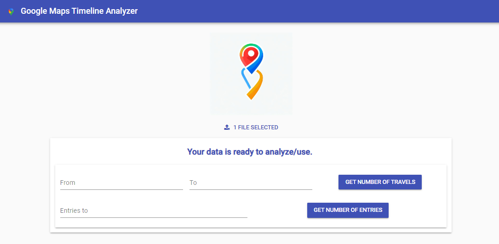

# Google Maps Timeline Analyzer

## Features

- Import and analyze Google Maps Timeline data.
- Track the number of entries to specific places.
- Analyze your travels to and from certain locations.
- Visualize your location history with user-friendly charts and graphs.

## Usage

1. **Import Data**: Import your Google Maps Timeline data by following the on-screen instructions.

2. **Analyze Data**: Gain insights into your location history, including the number of entries to specific places and your travels to and from certain locations.

## License

This project is licensed under the MIT License. See the [LICENSE](LICENSE) file for details.

Feel free to reach out if you have any questions or need assistance with the application. Enjoy analyzing your Google Maps Timeline data!
